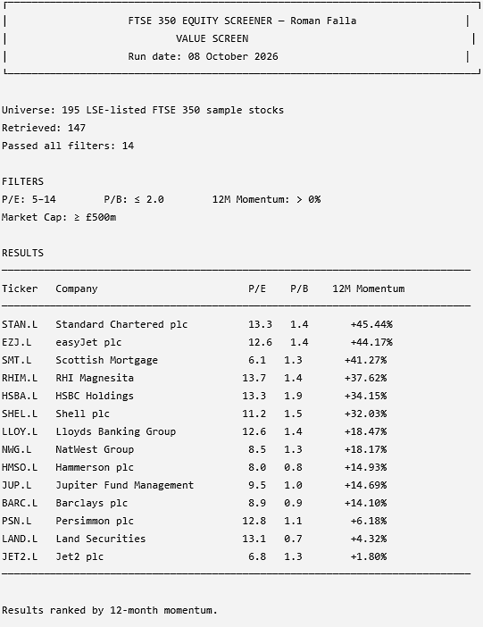
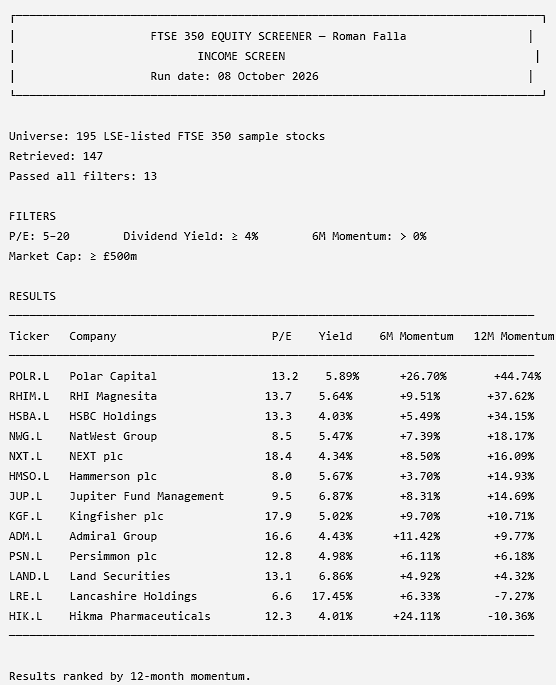
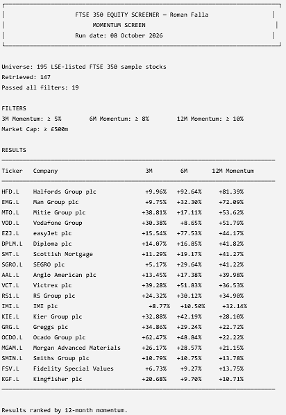
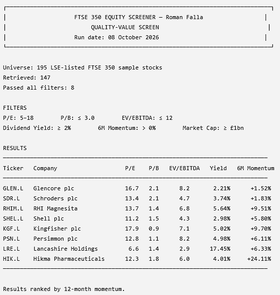

# FTSE 350 Equity Screener

A Python-based equity screening tool for a sample of FTSE 350 constituents listed on the London Stock Exchange. The screener combines valuation, income, market-cap and price-momentum signals to identify stocks matching predefined investment criteria.

## What it does

* Retrieves current market and fundamental data from Yahoo Finance at runtime
* Screens stocks using valuation multiples including P/E, P/B and EV/EBITDA
* Calculates dividend yield from dividends paid over the trailing 365 days relative to the current share price
* Calculates 3-month, 6-month and 12-month price momentum
* Applies minimum market-cap and trading-volume filters
* Provides four predefined screening strategies plus a default screen
* Reports unavailable or invalid tickers rather than stopping the entire screening process
* Exports screening results to a dated CSV file

## Preset screens

| Screen        | Criteria                                                                                                                        |
| ------------- | ------------------------------------------------------------------------------------------------------------------------------- |
| Default       | P/E 5–25, P/B ≤ 4, EV/EBITDA ≤ 15, dividend yield ≥ 1.5%, positive 3m/6m/12m momentum, market cap ≥ £500m, average volume ≥ 50k |
| Value         | P/E 5–14, P/B ≤ 2, positive 12m momentum, market cap ≥ £500m                                                                    |
| Income        | P/E 5–20, dividend yield ≥ 4%, positive 6m momentum, market cap ≥ £500m                                                         |
| Momentum      | 3m ≥ 5%, 6m ≥ 8%, 12m ≥ 10%, market cap ≥ £500m                                                                                 |
| Quality-Value | P/E 5–18, P/B ≤ 3, EV/EBITDA ≤ 12, dividend yield ≥ 2%, positive 6m momentum, market cap ≥ £1bn                                 |

## Example output

The screener produces a ranked table containing:

* Ticker and company name
* Sector
* Share price
* Market capitalisation
* P/E ratio
* P/B ratio
* EV/EBITDA
* Dividend yield
* 3m, 6m and 12m momentum
* 52-week high and low
* Beta

Results are sorted by 12-month momentum and saved as a dated CSV file.

## Usage

Install the required packages:

```bash
pip install -r requirements.txt
```

Then run:

```bash
python ftse350_equity_screener.py
```

The program presents a menu allowing the user to select a predefined screen.

### Custom screening

Individual thresholds can also be passed directly to `run_screener()`:

```python
from ftse350_equity_screener import run_screener

results = run_screener(
    max_pe=15,
    min_div_yield=0.03,
    min_momentum_3m=0.05
)
```

## Methodology

### Price momentum

Momentum is calculated using trailing price returns over:

* 63 trading days — approximately 3 months
* 126 trading days — approximately 6 months
* 252 trading days — approximately 12 months

The calculation compares the latest available closing price with the closing price at the corresponding historical trading-day interval.

### Valuation data

Fundamental metrics are retrieved from Yahoo Finance's fundamentals data, including P/E, P/B, EV/EBITDA and market capitalisation.

Stocks with missing data for a metric required by an active screen are excluded from that screen. This prevents incomplete data from incorrectly passing a filter.

### Dividend yield

Dividend yield is calculated independently from Yahoo Finance's reported yield field. The screener sums dividends paid over the trailing 365 days and divides this by the current share price.

This approach avoids inconsistencies in dividend-yield units that can occur in financial data feeds.

### Universe

The screener currently uses a hand-selected sample of **195 LSE-listed FTSE 350 constituents**, using Yahoo Finance's `.L` ticker suffix.

It is therefore a **FTSE 350 sample rather than a complete automated FTSE 350 index constituent feed**. Tickers for which Yahoo Finance data cannot be retrieved are reported as unavailable/invalid during each run.

## Project structure

```text
ftse350-equity-screener/
├── README.md
├── ftse350_equity_screener.py
├── requirements.txt
├── .gitignore
├── value_screen.png
├── income_screen.png
├── momentum_screen.png
└── quality_value_screen.png
```

## Limitations

* The universe is a 195-stock sample rather than the complete FTSE 350.
* Fundamental data depends on Yahoo Finance and may occasionally be unavailable, delayed or inconsistent.
* Some companies, particularly financial institutions and investment trusts, may not have meaningful values for metrics such as EV/EBITDA.
* Momentum is based on historical price performance and is not a prediction of future returns.
* The screens are quantitative filters and should not be interpreted as investment recommendations.

## Example Outputs

### Value Screen


### Income Screen


### Momentum Screen


### Quality-Value Screen

